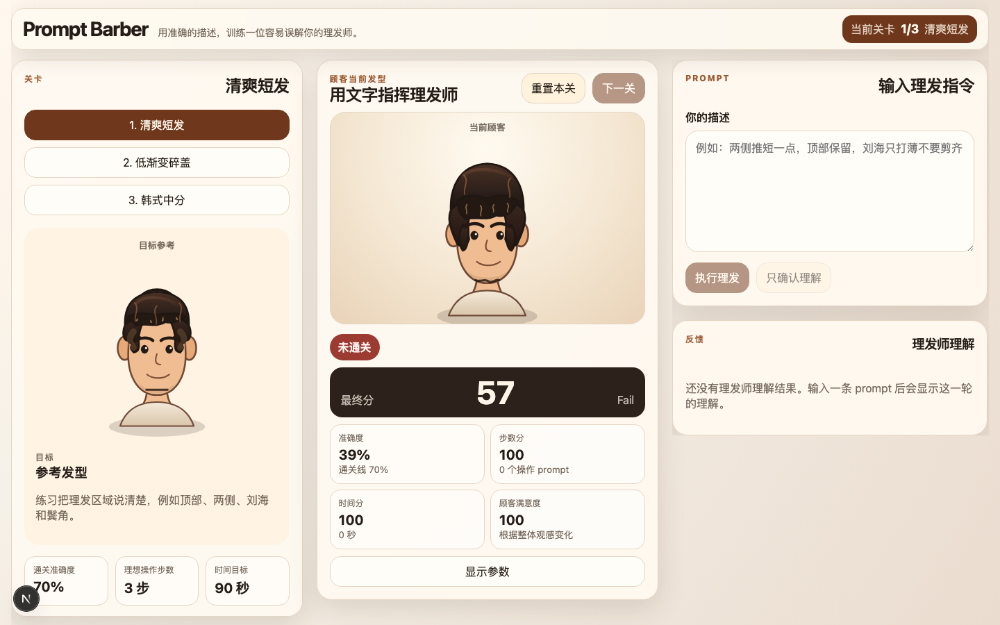
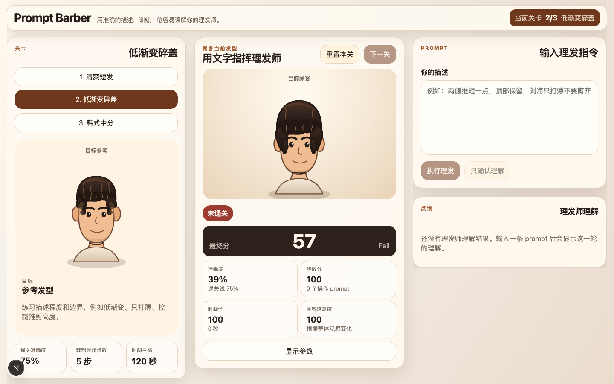
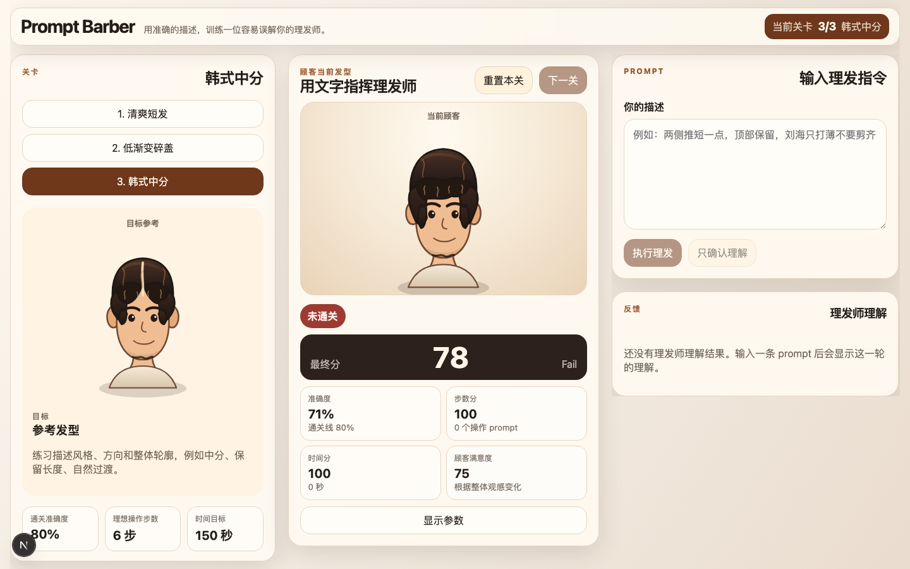

# Prompt Barber

Prompt Barber 是一个基于 prompt 的理发沟通游戏 MVP。玩家看到当前发型和目标参考发型，不能直接点击剪发按钮，只能用自然语言描述理发需求。系统会把描述解析成结构化发型操作，修改 SVG 发型，并根据目标参数评分。

## 截图



<p>
  
  
</p>

## 核心玩法

每一关都有一个目标发型。玩家通过中文 prompt 指挥理发师，例如：

```text
两侧推短一点，顶部保留，刘海只打薄不要剪齐
```

系统会输出理发师理解结果，执行可行操作，并给出：

1. 准确度
2. 步数分
3. 时间分
4. 禁忌分
5. 最终分与等级
6. 哪些区域最接近目标，哪些区域偏差最大

## 技术结构

```text
app/page.tsx                         主游戏页面
app/api/parse/route.ts                可选 AI 解析接口
app/api/barber-copy/route.ts          可选 AI 理发师反馈文案接口
components/HairRenderer.tsx           SVG 发型渲染
components/LevelPanel.tsx             关卡与目标发型
components/GameStage.tsx              当前顾客和分数
components/PromptComposer.tsx         prompt 输入区
components/FeedbackCard.tsx           反馈卡片
components/HistoryLog.tsx             理解日志
lib/hair/types.ts                     类型定义
lib/hair/levels.ts                    三个关卡
lib/hair/applyIntent.ts               操作应用与不可逆规则
lib/hair/scoring.ts                   评分系统
lib/hair/schema.ts                    AI 结构化输出 schema
lib/hair/barberCopyInput.ts           把结构化结果转换成文案事实
lib/hair/barberCopyFallback.ts        本地确定性理发师文案 fallback
lib/hair/barberCopySchema.ts          理发师反馈结构化输出 schema
lib/hair/gameReducer.ts               游戏状态 reducer
tests                                纯函数测试
```

## 运行方式

安装依赖：

```bash
npm install
```

启动开发服务器：

```bash
npm run dev
```

打开浏览器访问：

```text
http://localhost:3000
```

运行测试：

```bash
npm run test
```

运行 TypeScript 检查：

```bash
npm run lint
```

## LLM 解析

游戏的自然语言理解全部由 LLM 完成，不再使用本地规则解析器猜测玩家意图。自动模式会先尝试调用本机 Codex CLI，再尝试 OpenAI API；如果两者都不可用，本次 prompt 不会执行理发操作。

为保证玩法公平，解析 LLM 只会收到通用游戏背景、可操作的发型字段说明和玩家输入的修剪指令。它不会收到关卡名、目标发型参数、当前发型参数、通关阈值、评分规则或禁忌规则；这些信息只在游戏状态、执行约束和评分环节使用。

Codex CLI 解析需要本机已经安装并登录 Codex。默认路径会先尝试：

```text
/Applications/Codex.app/Contents/Resources/codex
```

也可以在 `.env.local` 指定：

```bash
CODEX_CLI_PATH=/Applications/Codex.app/Contents/Resources/codex
CODEX_CLI_MODEL=gpt-5.4
CODEX_CLI_REASONING_EFFORT=low
CODEX_CLI_SERVICE_TIER=priority
CODEX_CLI_TIMEOUT_MS=30000
```

默认 Codex CLI 解析使用最低推理强度 `low`，并把服务层设置为 `priority`，也就是 Codex 模型目录里的 Fast tier。`gpt-5.4-mini` 当前没有 Fast tier；如果你改回 mini，速度层配置可能不会生效。

如需临时关闭 Codex CLI 解析：

```bash
CODEX_CLI_DISABLED=1
```

如需开启 API 解析，在项目根目录创建 `.env.local`：

```bash
OPENAI_API_KEY=你的_key
OPENAI_MODEL=gpt-5.4-mini
OPENAI_BARBER_COPY_MODEL=gpt-5.4-mini
```

注意：不要把 API key 写成 `NEXT_PUBLIC_OPENAI_API_KEY`。带 `NEXT_PUBLIC_` 前缀的环境变量会暴露到浏览器端，这个项目只允许在服务端 route handler 里读取 API key。

如果 Codex CLI 或 API 解析失败，前端会显示错误提示并保持当前发型不变，不会回退到本地规则。

## 理发师反馈文案

玩家可见的“理发师理解”只展示一个短标题和一段自然中文反馈，不展示 parser、模型、耗时、字段名、参数值或操作列表。

`app/api/barber-copy/route.ts` 会把已经执行过的结构化结果转换成安全的人类可读事实，再调用 OpenAI Responses API 生成展示文案。这个 LLM 只负责表达，不决定理发操作，不修改 `HairState`，不参与评分。

文案输入会包含玩家最新原话、最近 1-3 轮简短上下文、可展示的理发事实和轻量 `interactionGuidance`。这样类似“再短一点”“不是这个意思”“你剪太少了”这类跟进句会被当作对话回应处理，而不是只机械复述操作事实。

如果未设置 `OPENAI_API_KEY`，或文案 API 失败，前端会使用 `lib/hair/barberCopyFallback.ts` 的本地确定性 fallback。玩法逻辑和评分不受影响。

文案模型选择顺序：

```text
OPENAI_BARBER_COPY_MODEL
OPENAI_MODEL
gpt-5.4-mini
```

## 评分公式

通关只看准确度：

```text
accuracyScore >= 当前关卡通关阈值
```

最终展示分数为：

```text
finalScore = accuracyScore * 0.70 + stepScore * 0.15 + timeScore * 0.10 + constraintScore * 0.05
```

准确度基于隐藏目标参数计算，不直接依赖图片相似度。这样玩家看到的是参考图，但系统实际判断的是发型结构是否接近目标。

参数权重：

```text
顶部长度 15
两侧长度 15
刘海长度 15
渐变高度 12
蓬松度 10
纹理层次 10
鬓角长度 8
分缝 8
后颈线条 7
```

不可逆规则：顶部、两侧、刘海、鬓角不能在同一轮中变长。如果玩家要求“再长一点”，系统会提示头发不能立刻长回来。

## 三个关卡

1. 清爽短发：练习把区域说清楚。
2. 低渐变碎盖：练习描述程度和边界。
3. 韩式中分：练习描述风格、方向和禁忌。

## 添加新关卡

编辑 `lib/hair/levels.ts`，增加一个 `LevelConfig`：

```ts
{
  id: "new-level",
  name: "新发型",
  goal: "这一关训练什么表达能力",
  target: {
    topLength: 6,
    sideLength: 3,
    bangsLength: 5,
    fadeHeight: 1,
    volume: 4,
    texture: 4,
    sideburns: 3,
    parting: "none",
    neckline: "natural"
  },
  passAccuracyThreshold: 75,
  idealOperationSteps: 5,
  timeTargetSeconds: 120,
  forbiddenRules: [],
  hints: ["示例 prompt"]
}
```

## 当前限制

这是一个验证核心机制的 MVP。发型渲染是参数化 SVG，不是真实 3D 头发，也没有图像生成。优点是成本低、反馈快、评分稳定。后续可以把渲染层替换成 3D 或图像生成，但不需要改掉解析、状态和评分的核心逻辑。
